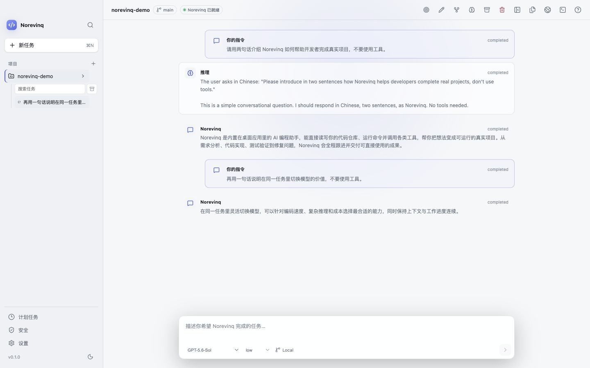

# Norevinq

[简体中文](README.md) | **English**

[](https://github.com/xingchen20lj/norevinq-desktop/actions/workflows/ci.yml)
[](LICENSE)


Norevinq is a local-first desktop AI coding workspace for macOS and Windows. It uses Codex app-server as its agent protocol layer and provides native support for OpenAI Codex, DeepSeek Responses, Git worktrees, diff review, an integrated terminal, MCP, skills, scheduled tasks, and Codex Security.

> Norevinq is currently a `0.1.0` preview. This GitHub repository distributes source code, source tags, and build instructions only. It does not provide DMG, EXE, or other prebuilt installers. Norevinq is an independent open-source project and is not an official OpenAI or DeepSeek product.

> **Official source:** Norevinq is created and maintained by [xingchen20lj](https://github.com/xingchen20lj). The only canonical source repository is [xingchen20lj/norevinq-desktop](https://github.com/xingchen20lj/norevinq-desktop). Copies, modified builds, and installers not published or explicitly linked by this repository are not official releases.



## Norevinq in One Minute

This demonstration walks through real multi-model tasks, the command palette, model providers, the security workbench, and scheduled tasks.

https://github.com/user-attachments/assets/2bba3f47-3a63-45a2-9c9e-1ce239e69960

## Implemented Capabilities

- Codex app-server lifecycle management, protocol handshake, streaming activity, approvals, steering, interruption, and recovery.
- OpenAI login/API Key support and DeepSeek V4 Flash and V4 Pro through the Responses API.
- Git status, staging, commits, pushes, GitHub draft pull requests, worktrees, and per-hunk diff operations.
- Integrated terminal; file, image, PDF, audio, and video preview; and a web preview restricted to local addresses.
- MCP, skills, layered configuration, scheduled tasks, the security workbench, and light/dark desktop interfaces.
- An isolated application data directory, OS-backed secure storage, IPC authorization, path constraints, log redaction, and update security checks.

Feature status is based only on real code, automated tests, and runtime evidence. See the [feature parity matrix](docs/FEATURE_PARITY.md) for the complete inventory.

## Quick Start

### Run from Source

Install Git, Node.js `24.14.0`, and pnpm `11.16.0`:

```bash
git clone https://github.com/xingchen20lj/norevinq-desktop.git
cd norevinq-desktop
pnpm install --frozen-lockfile
pnpm verify:ci
pnpm dev
```

### Build a Local Installer

macOS:

```bash
CSC_IDENTITY_AUTO_DISCOVERY=false pnpm package:mac
```

Windows PowerShell:

```powershell
pnpm package:win
```

Artifacts are written to `release/`. macOS builds produce DMG/ZIP files and Windows builds produce an NSIS EXE. Unsigned packages are intended for local testing only; public distribution requires the appropriate platform signing verification.

See the [beginner build guide](docs/BUILDING.md) for first-build instructions, proxy configuration, and common errors. See the [release guide](docs/RELEASING.md) for signing, updates, and the release process.

## Accounts and External Dependencies

- Building the application does not require OpenAI or DeepSeek credentials.
- Using online OpenAI models requires signing in to ChatGPT inside Norevinq or configuring an OpenAI API Key.
- DeepSeek can use a key saved securely in Settings or the `DEEPSEEK_API_KEY` environment variable supplied at launch.
- GitHub pull request support uses the user's existing authenticated `gh` CLI session. Norevinq does not read or store the GitHub token.
- Codex Security scans require Python 3.10+. OpenAI mode is subject to account Security/Trusted Access permissions. DeepSeek V4 Flash and V4 Pro can use `DEEPSEEK_API_KEY` directly without an OpenAI login; both have completed real `completed + sealed` standard scans in Norevinq 0.1.0. On macOS, deep scans retain the official outer `codex_security_scan` permission boundary while avoiding a discovery-worker `EPERM` caused by Seatbelt not supporting reliable nesting. This compatibility layer applies only to child processes inside the verified outer sandbox; other scan modes and platforms are unaffected.

Norevinq stores SQLite data, logs, worktree metadata, credentials, and `agent-home` in its own Electron `userData` directory and does not overwrite the official Codex desktop application's data. Older `codex-home` data is migrated in place to `agent-home` on first launch. Project-level `.codex` and `AGENTS.md` files continue to follow upstream compatibility rules.

## More Screens

| Command palette | Model providers |
| --- | --- |
|  |  |
| Scheduled tasks | Security workbench |
|  |  |

## Documentation

- [Beginner build guide](docs/BUILDING.md)
- [Complete macOS uninstall guide](docs/UNINSTALL.md)
- [Architecture](docs/ARCHITECTURE.md)
- [Testing strategy](docs/TESTING.md)
- [Security policy](SECURITY.md)
- [Release process](docs/RELEASING.md)
- [Current development state](docs/AUTONOMOUS_STATE.md)
- [Third-party licenses](THIRD_PARTY_NOTICES.md)
- [Authors and contributors](AUTHORS.md)
- [Citation information](CITATION.cff)
- [Brand and third-party trademark notice](TRADEMARKS.md)
- [Preliminary name research](docs/BRANDING.md)

## Contributing

Before submitting an issue or code, read the [contributing guide](CONTRIBUTING.md) and [code of conduct](CODE_OF_CONDUCT.md). Use GitHub Issues for general reports. Do not disclose security issues publicly; follow the [security policy](SECURITY.md) and use a private GitHub Security Advisory.

## License

Norevinq is released under the [Apache License 2.0](LICENSE). Third-party licenses and sources are documented in [THIRD_PARTY_NOTICES.md](THIRD_PARTY_NOTICES.md) and [NOTICE](NOTICE). Product naming, icons, and third-party trademark boundaries are documented in [TRADEMARKS.md](TRADEMARKS.md).
