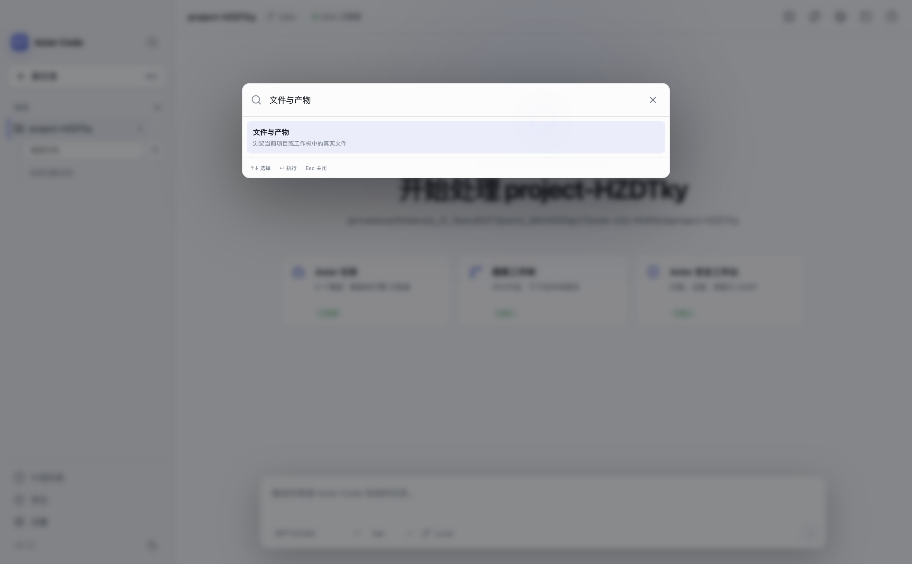
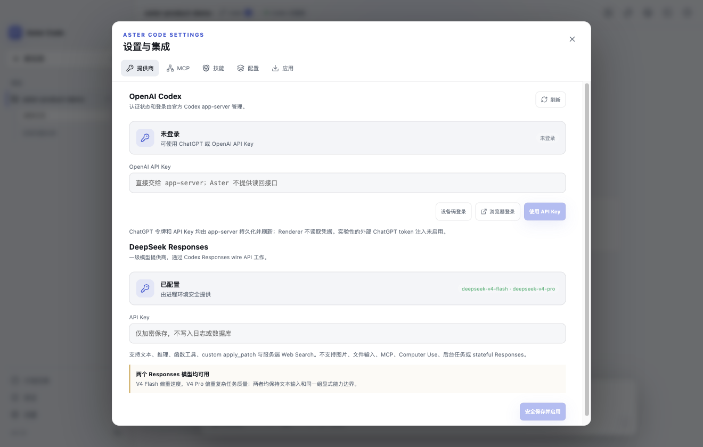
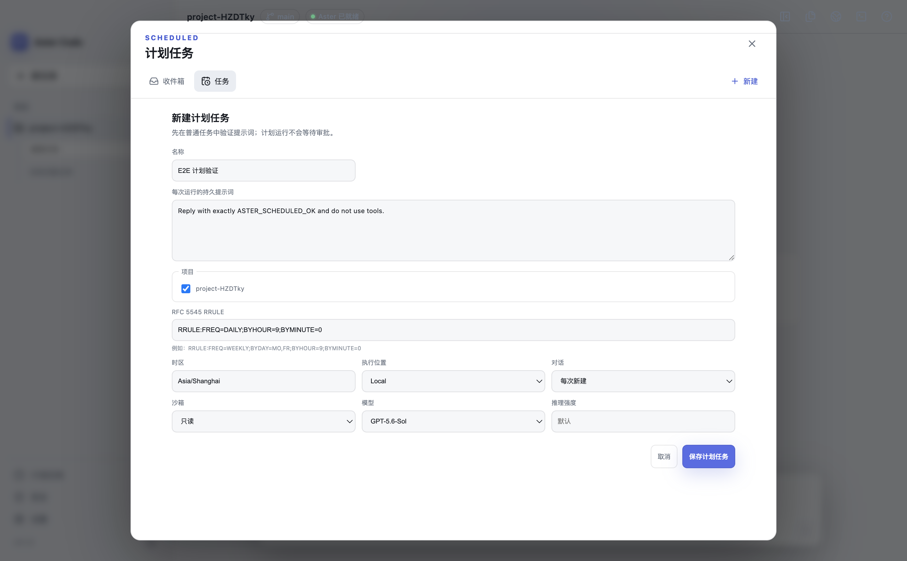
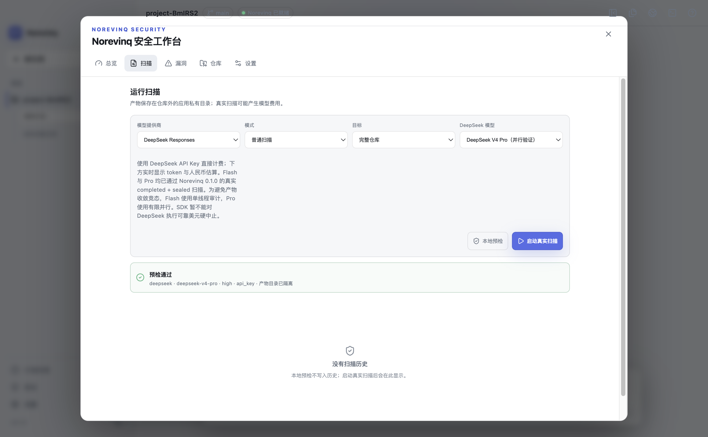

# Aster Code

[](https://github.com/xingchen20lj/aster-code-desktop/actions/workflows/ci.yml)
[](LICENSE)


Aster Code 是一款面向 macOS 和 Windows 的本地优先桌面智能编程客户端。它以 Codex app-server 为智能体协议层，原生支持 OpenAI Codex、DeepSeek Responses、Git 工作树、差异审阅、终端、MCP、技能、计划任务和 Codex Security。

> 当前处于 `0.1.0` 预览阶段。源码、测试和无签名内部安装包已经过验证；正式公开安装包仍需要平台签名、公证和 Windows 真机发布验证。Aster Code 是独立开源项目，不是 OpenAI 或 DeepSeek 官方产品。



## 已实现能力

- Codex app-server 生命周期、协议握手、流式活动、审批、追加指令、中断与恢复。
- OpenAI 登录/API Key 与 DeepSeek V4 Flash、V4 Pro Responses 接入。
- Git 状态、暂存、提交、推送、GitHub Draft PR、工作树和逐 hunk 差异操作。
- 集成终端、文件/图片/PDF/音视频预览和仅允许本地地址的网页预览。
- MCP、技能、分层配置、计划任务、安全工作台和深浅色桌面界面。
- 独立应用数据目录、系统安全存储、IPC 授权、路径约束、日志脱敏与更新安全检查。

功能状态只以真实代码、自动测试和运行证据为准。完整清单见[功能一致性表](docs/FEATURE_PARITY.md)。

## 快速开始

### 运行源码

准备 Git、Node.js `24.14.0` 和 pnpm `11.16.0`：

```bash
git clone https://github.com/xingchen20lj/aster-code-desktop.git
cd aster-code-desktop
pnpm install --frozen-lockfile
pnpm verify:ci
pnpm dev
```

### 生成本机安装包

macOS：

```bash
CSC_IDENTITY_AUTO_DISCOVERY=false pnpm package:mac
```

Windows PowerShell：

```powershell
pnpm package:win
```

产物写入 `release/`。macOS 生成 DMG/ZIP，Windows 生成 NSIS EXE。无签名包只适合本地测试；公开分发前必须完成相应平台的签名验证。

第一次构建、代理配置、常见错误和 GitHub Actions 打包方式见[新手构建指南](docs/BUILDING.md)。正式签名、更新和发布流程见[发布指南](docs/RELEASING.md)。

## 账号与外部依赖

- 构建应用不需要 OpenAI 或 DeepSeek 凭据。
- 使用在线 Codex 时需要在 Aster 内登录 ChatGPT 或配置 OpenAI API Key。
- 使用 DeepSeek 时可在设置中安全保存 Key，或在启动环境提供 `DEEPSEEK_API_KEY`。
- GitHub Pull Request 功能通过用户已经登录的 `gh` CLI 工作，Aster 不读取或保存 GitHub token。
- Codex Security 扫描需要 Python 3.10+；OpenAI 模式受账户 Security/Trusted Access 权限约束，DeepSeek V4 Flash 与 V4 Pro 可直接使用 `DEEPSEEK_API_KEY`，无需 OpenAI 登录。两者均已通过 Aster 0.1.0 的真实 `completed + sealed` 扫描；Flash 固定复用 Aster 0.147.0 运行时并串行审计，Pro 使用有限并行。

Aster 使用独立 Electron `userData` 目录保存 SQLite、日志、工作树、凭据和 Codex home，不会覆盖官方 Codex 桌面的用户数据。项目中的 `.codex` 和 `AGENTS.md` 仍遵循 Codex 项目配置规则。

## 更多界面

| 模型提供商 | 计划任务 | 安全工作台 |
| --- | --- | --- |
|  |  |  |

## 文档

- [新手构建指南](docs/BUILDING.md)
- [macOS 完全卸载说明](docs/UNINSTALL.md)
- [架构说明](docs/ARCHITECTURE.md)
- [测试策略](docs/TESTING.md)
- [安全策略](SECURITY.md)
- [发布流程](docs/RELEASING.md)
- [当前开发状态](docs/AUTONOMOUS_STATE.md)
- [第三方许可证](THIRD_PARTY_NOTICES.md)

## 参与贡献

提交问题或代码前请阅读[贡献指南](CONTRIBUTING.md)和[行为准则](CODE_OF_CONDUCT.md)。普通问题使用 GitHub Issues；安全问题不要公开披露，请按[安全策略](SECURITY.md)通过 GitHub Security Advisory 私下报告。

## 许可证

Aster Code 以 [Apache License 2.0](LICENSE) 发布。第三方组件的许可证与来源见 [THIRD_PARTY_NOTICES.md](THIRD_PARTY_NOTICES.md) 和 [NOTICE](NOTICE)。
