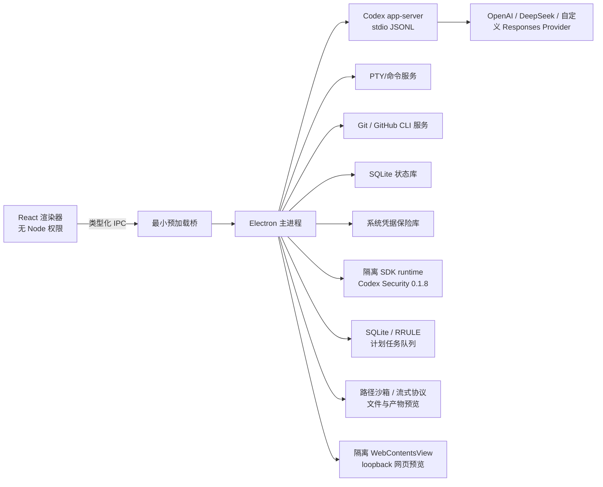

# 架构

## 目标

Aster Code 是一个本地优先的桌面壳。它不重新实现 Codex agent loop，而把 OpenAI 开源 `codex app-server` 作为权威运行时；产品层负责进程生命周期、协议适配、持久化、权限 UX、Git/终端/预览和多提供商能力描述。

## 进程边界

## 模块

- `src/main`：窗口、安全策略、IPC、进程和服务装配。
- `src/preload`：白名单 API；不暴露 `ipcRenderer`、文件系统或进程对象。
- `src/renderer`：React UI 与展示状态。
- `src/shared`：IPC schema、领域事件、模型能力和公共类型。
- `src/main/runtime`：app-server 启动、握手、请求关联、事件正规化、恢复、脱敏日志。
- `src/main/agent`：thread/turn 服务、server request 审批、活动 reducer、状态订阅与历史恢复。
- `src/main/providers`：provider 生命周期、能力目录和仅进程级 Codex 配置；不写用户全局 Codex 配置。
- `src/main/account`：稳定 app-server 账户读取、API Key/ChatGPT 托管登录、官方域外链、用量和登录重启状态机；不持有可读 token 库。
- `src/main/integrations`：MCP/技能/配置/项目指令适配器、反向交互挂起状态和有界领域模型。
- `src/main/security/credentialStore.ts`：操作系统加密适配、仓库外 0600 原子凭据文件；不提供读取密钥的 IPC。
- `src/main/git`：项目根绑定的无 shell Git runner、porcelain v2 NUL parser、GitHub CLI 预检/PR 创建、超时/输出边界和变更操作。
- `src/main/git/diffService.ts`：working/staged patch、untracked/二进制归一和 2/16 MiB 展示预算。
- `src/main/worktree`：仓库外托管 worktree、数据库恢复、ownership 校验、锁定/删除和受限 include 复制。
- `src/main/git`：仓库状态、worktree、diff、stage/revert/commit/push。
- `src/main/terminal`：PTY 生命周期和有界输出。
- `src/main/security/securityService.ts`：独立于主 app-server 的 SDK 0.1.8/内置 Codex 0.144.6 扫描运行时、AbortSignal、进度、SQLite 历史和有界 artifact/CLI 操作。SDK 自身以异步子进程执行模型工作；主进程只接收回调，不在 renderer 加载 SDK。
- `src/main/scheduler`：IANA 时区/RFC 5545 RRULE、SQLite 持久化队列、错过运行、重试、取消和真实 app-server/worktree 执行。
- `src/main/files`：项目/worktree 根绑定、逐段 symlink 拒绝、有界文本读取、不透明媒体 token、Range 流和外部打开策略。
- `src/main/browser`：独立临时 session、loopback URL/子资源策略、原生 WebContentsView 生命周期、权限拒绝、控制台与导航状态。

## 关键不变量

1. 渲染器永不直接执行 shell、读取任意路径或访问 provider secret。
2. app-server 原始协议只存在于适配层；UI 只消费带版本的领域事件。
3. 所有文件/Git/终端操作都绑定已打开且已信任的项目根目录。
4. 所有长期流都支持取消、超时、背压和崩溃后的可解释状态。
5. 日志默认脱敏 bearer token、API key、授权头、环境变量和疑似凭据。
6. 真实外部能力缺失时返回明确诊断，绝不生成伪造成功数据。
7. renderer 只提交已登记项目 ID；工作目录在主进程数据库解析，不能借 IPC 指向任意路径。
8. 命令与文件审批默认保持 pending，只有明确用户决策才向 app-server 回应；关闭时统一 cancel。
9. 网络与路径权限只能从 app-server 原请求白名单中选择；Renderer 只提交不透明 ID，主进程重建授权子集并拒绝未请求项。
10. OpenAI API Key 只通过 app-server 稳定登录接口提交；ChatGPT loginId 与认证 URL 保留在主进程，URL 必须属于 OpenAI/ChatGPT HTTPS 域，Renderer 不接触 token。
11. provider key 只从环境或 OS 加密保险库进入 app-server 子进程；配置、SQLite、日志、snapshot 和 renderer 均不含明文。
12. worktree 路径由主进程创建和登记；renderer/agent 只能传 worktree UUID，不能直接注入 cwd。
13. Security 输出固定在 userData 私有目录且不位于任何被扫工作树内；只有 completed + sealed contract 的扫描可导入 finding、报告或执行验证/修复。
14. Security validate/patch/false-positive/export 只通过官方 CLI 参数数组调用；patch 要求 UI 显式二次确认，renderer 不能指定路径或原始命令。
15. 崩溃诊断只在主进程本地有界持久化；Renderer 无法指定存储路径，只能触发系统保存对话框。ZIP 经字段密钥、自由文本和绝对路径三重脱敏，不包含对话或项目文件，不实现自动上传。
16. 计划任务只执行已登记项目；同一任务不重叠，崩溃后运行标记失败且不自动重放，避免重复文件或命令副作用。
17. 文件预览只使用项目相对路径；任何符号链接组件和根目录逃逸都失败关闭，媒体 URL 不包含本地路径且短时过期。
18. 内嵌浏览器不含 preload/Node/Aster IPC，只允许 loopback 顶级导航与子资源；所有设备权限、下载和弹窗默认拒绝。
19. 窗口状态只由主进程写入内部 SQLite；恢复前必须验证数值、最小尺寸和当前显示器交集，损坏状态回退默认值。
20. GitHub PR 只在用户二次确认后写入；正文经 stdin，`gh` 使用最小环境，head/base 从登记远端重建，结果必须通过结构化回读和同源 URL 校验。

## 上游与公开资料

- [Codex App Server](https://learn.chatgpt.com/docs/app-server.md)
- [OpenAI Codex 源码](https://github.com/openai/codex)
- [Codex Security SDK](https://learn.chatgpt.com/docs/security/sdk.md)
- [Codex Security 源码](https://github.com/openai/codex-security)
- [Codex Worktrees](https://learn.chatgpt.com/docs/environments/git-worktrees.md)
- [Codex Scheduled Tasks](https://learn.chatgpt.com/docs/automations.md)
