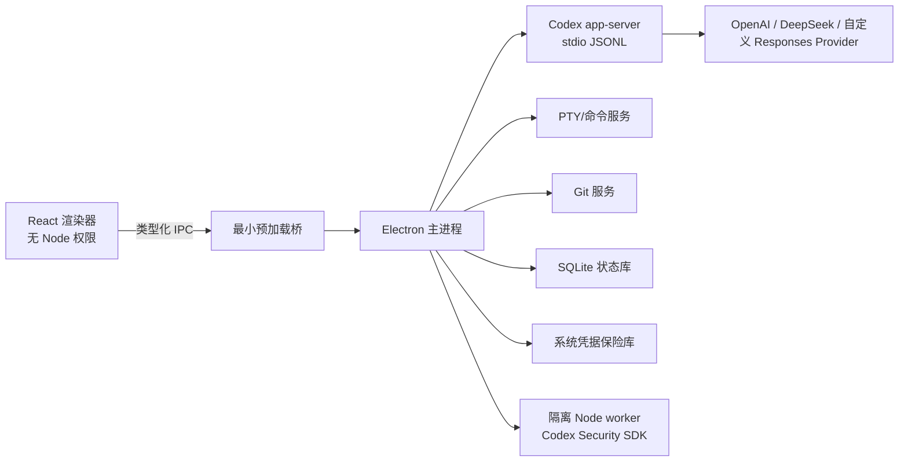

# 架构

## 目标

Aster Code 是一个本地优先的桌面壳。它不重新实现 Codex agent loop，而把 OpenAI 开源 `codex app-server` 作为权威运行时；产品层负责进程生命周期、协议适配、持久化、权限 UX、Git/终端/预览和多提供商能力描述。

## 进程边界

## 模块

- `src/main`：窗口、安全策略、IPC、进程和服务装配。
- `src/preload`：白名单 API；不暴露 `ipcRenderer`、文件系统或进程对象。
- `src/renderer`：React UI 与展示状态。
- `src/shared`：IPC schema、领域事件、模型能力和公共类型。
- `src/main/runtime`：app-server 启动、握手、请求关联、事件正规化、恢复、脱敏日志。
- `src/main/agent`：thread/turn 服务、server request 审批、活动 reducer、状态订阅与历史恢复。
- `src/main/providers`：provider 生命周期、能力目录和仅进程级 Codex 配置；不写用户全局 Codex 配置。
- `src/main/security/credentialStore.ts`：操作系统加密适配、仓库外 0600 原子凭据文件；不提供读取密钥的 IPC。
- `src/main/git`：仓库状态、worktree、diff、stage/revert/commit/push。
- `src/main/terminal`：PTY 生命周期和有界输出。
- `src/main/security`：SDK worker、扫描状态、artifact 导入与导出。
- `src/main/scheduler`：RRULE、持久化队列、错过运行和隔离工作树。

## 关键不变量

1. 渲染器永不直接执行 shell、读取任意路径或访问 provider secret。
2. app-server 原始协议只存在于适配层；UI 只消费带版本的领域事件。
3. 所有文件/Git/终端操作都绑定已打开且已信任的项目根目录。
4. 所有长期流都支持取消、超时、背压和崩溃后的可解释状态。
5. 日志默认脱敏 bearer token、API key、授权头、环境变量和疑似凭据。
6. 真实外部能力缺失时返回明确诊断，绝不生成伪造成功数据。
7. renderer 只提交已登记项目 ID；工作目录在主进程数据库解析，不能借 IPC 指向任意路径。
8. 命令与文件审批默认保持 pending，只有明确用户决策才向 app-server 回应；关闭时统一 cancel。
9. provider key 只从环境或 OS 加密保险库进入 app-server 子进程；配置、SQLite、日志、snapshot 和 renderer 均不含明文。

## 上游与公开资料

- [Codex App Server](https://learn.chatgpt.com/docs/app-server.md)
- [OpenAI Codex 源码](https://github.com/openai/codex)
- [Codex Security SDK](https://learn.chatgpt.com/docs/security/sdk.md)
- [Codex Security 源码](https://github.com/openai/codex-security)
- [Codex Worktrees](https://learn.chatgpt.com/docs/environments/git-worktrees.md)
- [Codex Scheduled Tasks](https://learn.chatgpt.com/docs/automations.md)
